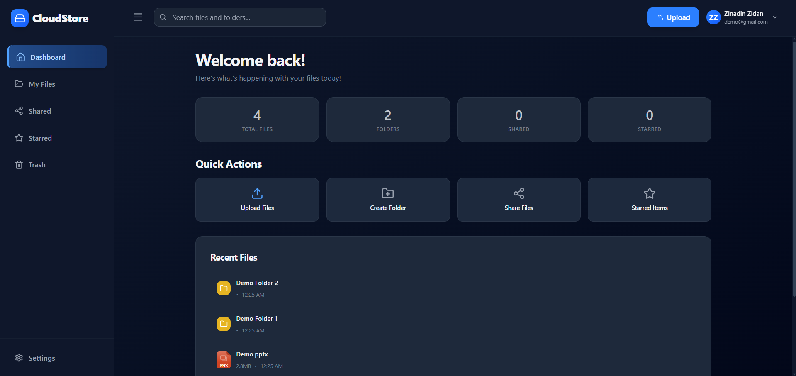
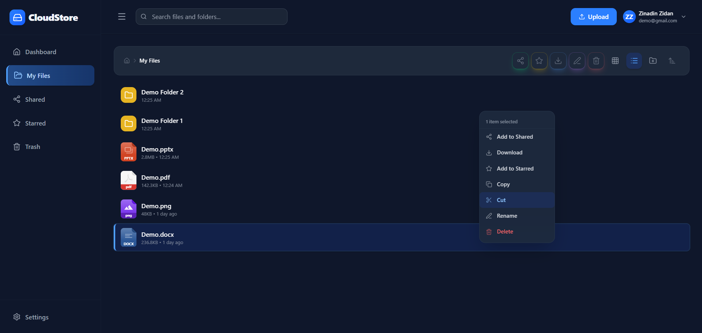

# TMA Cloud

A self-hosted cloud storage platform with file storage and management capabilities.

## Features

- 🔐 **Authentication** --- JWT-based auth with optional Google OAuth and MFA
- 🔒 **Signup Control** --- Self-hosted deployments can control user registration
- 📁 **File Management** --- Upload, download, organize, and manage files and folders
- 🔗 **Sharing** --- Create shareable links for files and folders
- 🌐 **Custom Share Domain** --- Dedicated domain for share links to isolate traffic
- 📝 **Document Editing** --- OnlyOffice integration for online document editing
- ⚡ **Redis Caching** --- High-performance caching layer for improved response times
- 🎨 **Modern UI** --- React + TypeScript frontend with Tailwind CSS
- 🗄️ **PostgreSQL** --- Robust database with automatic migrations
- 🧹 **Background Services** --- Automatic cleanup of trash and orphaned files
- 📊 **Audit Logging** --- Comprehensive audit trail with queue-based event tracking

## Quick Start

### Prerequisites

- Node.js (v25+)
- PostgreSQL (v17+)
- Redis (v6+)
- npm or yarn

### Installation

```bash
git clone https://github.com/TMA-Cloud/TMA.git
cd TMA
```

#### Frontend Setup & Build

```bash
cd ../frontend
npm install
npm run build
# Frontend will be built to dist/ dir
```

#### Backend Setup

```bash
cd backend
npm install
# Copy .env.example to .env
cp ../.env.example ../.env
# Edit ../.env with your configuration
npm start
# Access the application at http://localhost:3000
```

For detailed setup instructions, see the [Documentation Wiki](https://tma-cloud.github.io/TMA).

## UI Preview

A quick preview of the TMA Cloud interface.  
Full gallery available in the [Documentation Wiki](https://tma-cloud.github.io/TMA).

### Dashboard & File Manager

| Dashboard                                   | File Manager                                       |
|---------------------------------------------|----------------------------------------------------|
|  |   |

## Documentation

**Full documentation is available in the [Documentation Wiki](https://tma-cloud.github.io/TMA)**

## Contributing

Contributions, issues, and feature requests are welcome!\
Feel free to open a pull request or create an issue.

## License

This project is released under the [MIT License](LICENSE).

## Credits

- **[Zinadin Zidan](https://github.com/ZIDAN44)** --- Developer & creator
