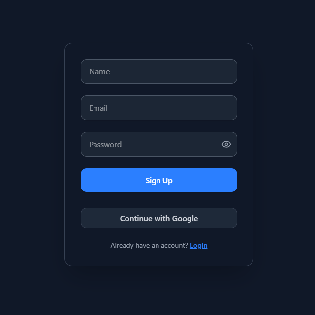
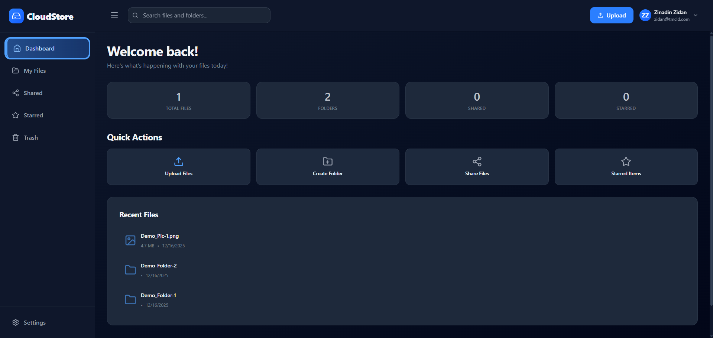
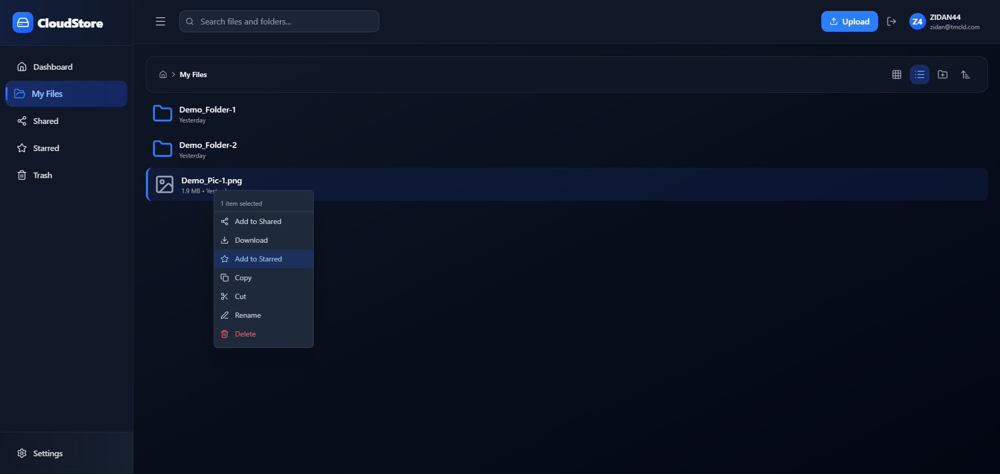
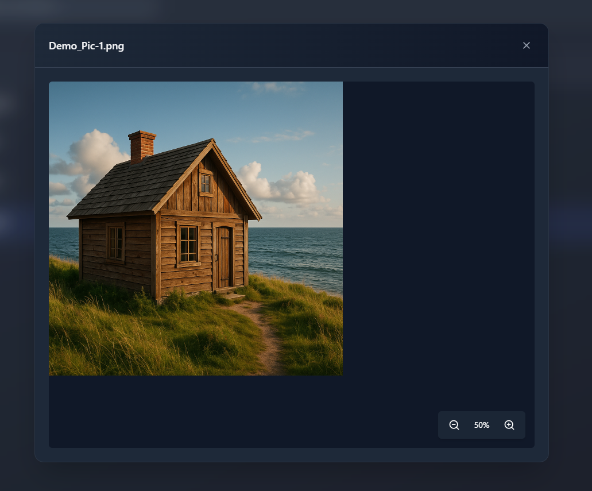
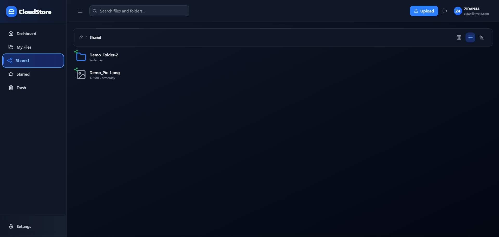
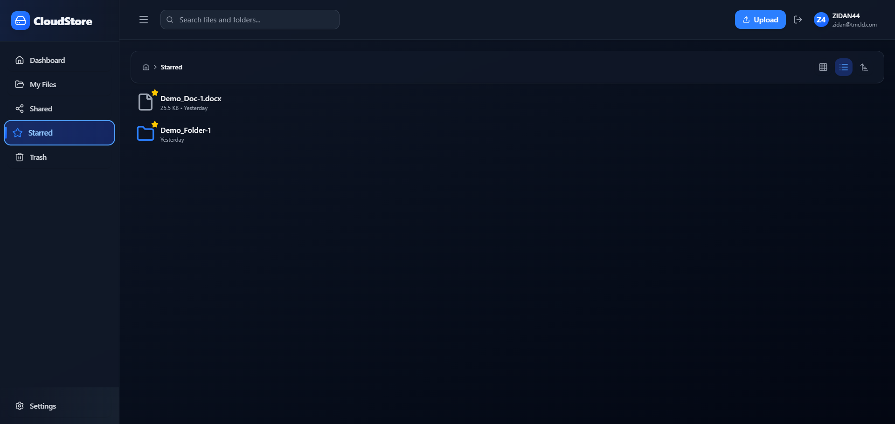
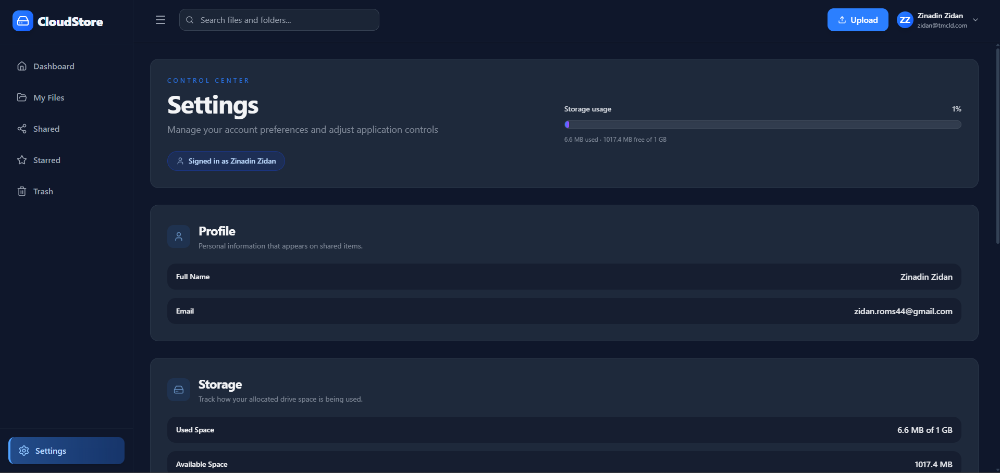
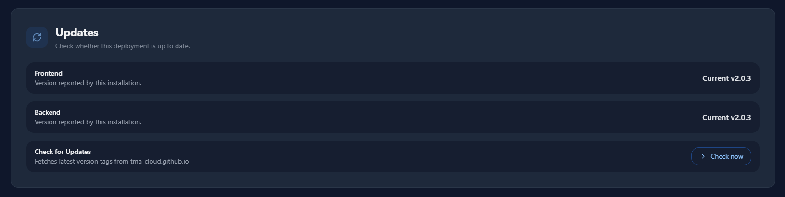
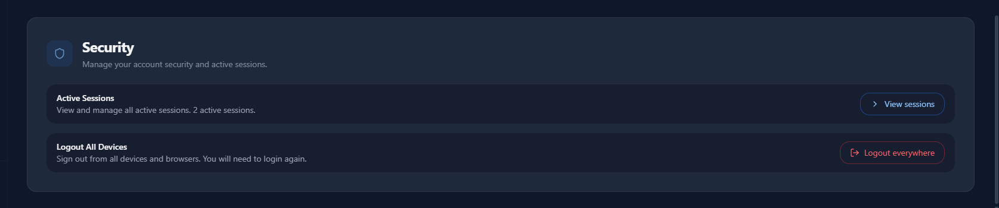

# TMA Cloud – Full Screenshot Gallery

This page contains the complete gallery of all available UI screenshots.

## Screenshot Index

- [Authentication](#authentication)
- [Dashboard & File Manager](#dashboard--file-manager)
- [Dashboard & File Manager Mobile View](#dashboard--file-manager-mobile-view)
- [Uploading & Sharing](#uploading--sharing)
- [Image Viewer](#image-viewer)
- [Document Viewer](#document-viewer)
- [Shared & Starred Files](#shared--starred-files)
- [Settings](#settings)
- [Admin & Registered Users](#admin--registered-users)
- [Check Updates](#check-updates)
- [Security Management](#security-management)
- [Active Sessions Management](#active-sessions-management)

---

## Authentication

| Login | Signup |
|-------|--------|
|  |  |

---

## Dashboard & File Manager

---

## Dashboard & File Manager Mobile View

| Dashboard                                         | File Manager                                            |
|---------------------------------------------------|---------------------------------------------------------|
| .png) | .png) |

---

## Uploading & Sharing

| Upload Modal | Share Link |
|--------------|------------|
|  |  |

---

## Image Viewer

---

## Document Viewer

---

## Shared & Starred Files

---

## Settings

---

## Admin & Registered Users

| Admin                              | Registered Users                          |
|------------------------------------|-------------------------------------------|
|  |  |

---

## Check Updates

---

## Security Management

---

## Active Sessions Management

